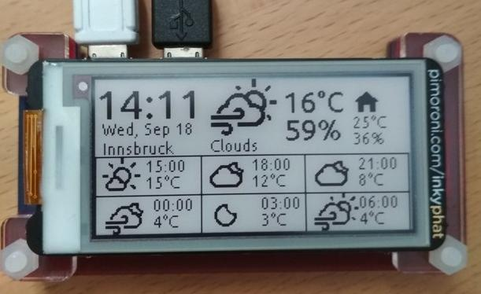

# inkyWeather

A Python script that draws weather conditions on an Pimoroni's [Inky-phat](https://learn.pimoroni.com/tutorial/sandyj/getting-started-with-inky-phat) e-paper display.   

It gets weather data from MQTT. 

JSON data format is the one provided by [OpenWeather](https://openweathermap.org/).    

It also gets temperature and humidity values from an indoor sensor.

Node-red flows used to get weather data are provided in the `examples` directory.    

The icons are drawn using [Weather Icons](https://erikflowers.github.io/weather-icons/) and [Nerd Fonts](https://www.nerdfonts.com/).   

It tries to make a smart use of Python, but it is nothing more than a programming exercise: be patient whit it.

InkyWeather can be executed once a minute by Cron. Es:

```
# inky phat display
* *     * * *   pi    /home/pi/Git/curr/inky-phat/inkyWeather/inkyWeather.py

```

Once executed, the display may look something like this:


